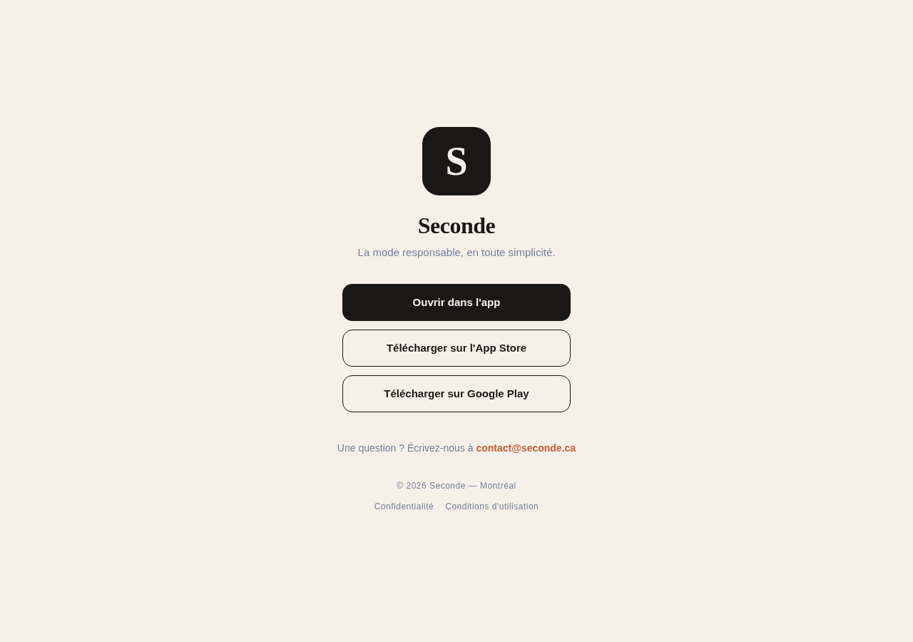
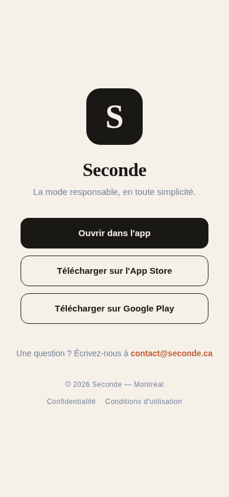

# Web local — landing native et isolation Stripe

L’export web local et son démarrage Chromium passent. Le site conserve la landing native existante de `public/index.html` : aucune marketplace web, activation de paiement ou publication n’a été ajoutée. Le bouton d’ouverture conserve le chemin et la query de l’article dans son lien `seconde://`.

## Constats revalidés et corrections

Deux problèmes distincts empêchaient le contrôle local. Les imports runtime de `@stripe/stripe-react-native` dans `hooks/useDeepLinking.ts`, `app/_layout.tsx` et `components/StripePayment.tsx` chargeaient `NativeCardField` / `codegenNativeCommands` dans le graphe Metro web. Leur isolation par plateforme a permis un premier export du graphe applicatif. Son exécution dans la landing a ensuite reproduit une erreur `rootTag` : Expo Router cherchait une racine React absente du document statique.

Le périmètre mobile est explicite dans le commentaire `app.config.js` existant. `firebase.json` publie `public/` avec une réécriture vers `/index.html`, et ce document contient déjà les CTA stores et le lien natif. Ajouter une racine React aurait changé cette destination. L’entrée personnalisée utilise le mécanisme documenté par [Expo Router — Custom entry point](https://docs.expo.dev/router/installation/), en conservant l’import Router pour les plateformes natives.

| Fichier | Correction / contrat |
| --- | --- |
| `package.json` | `main: ./index`, sans extension pour permettre la résolution par plateforme |
| `index.ts` | Importe `expo-router/entry` pour iOS/Android ; enregistrement natif inchangé |
| `index.web.ts` | Entrée inerte ; aucun montage React, import Router ou initialisation Firebase/Stripe dans la landing |
| `app.config.js` | Clarifie la distinction marketplace native / landing statique, sans ajouter de configuration produit |
| `lib/stripe.native.ts` | Provider et callback URL réexportés ; le hook retourne le même objet SDK natif |
| `lib/stripe.web.ts` | Provider transparent, callback false ; init/presentation Payment Sheet échouent explicitement avec `UnsupportedPlatform`, jamais un succès |
| `lib/stripe.types.ts` | Contrat minimal des opérations utilisées et erreur web ; import SDK uniquement de types |
| `lib/stripe.ts` | Entrée TypeScript/default ; Metro sélectionne la variante `.web.ts` ou `.native.ts` |
| `app/_layout.tsx`, `hooks/useDeepLinking.ts`, `components/StripePayment.tsx` | Imports via l’adaptateur commun |
| `tests/jest/platformEntry.test.ts` | Résolution Expo réelle du package pour les trois plateformes et inscription Router native seulement |
| `tests/jest/stripe.native.test.ts`, `tests/jest/stripe.web.test.tsx` | Conservation du contrat natif et indisponibilité web sans chargement du SDK natif |

Les variantes Stripe ont la même extension `.ts`, afin que la priorité de plateforme de Metro s’applique. Le premier export, avant séparation de la landing, a confirmé l’absence de `NativeCardField` et la sélection de l’erreur `UnsupportedPlatform` dans le graphe web applicatif. Le **dernier export** est celui de la landing ; son bundle est inerte et n’inclut plus ce graphe applicatif.

`public/index.html` et la configuration Hosting restent inchangés. Le SDK natif et le plugin Expo restent en place. `PAYMENTS_ENABLED=false` et `SHIPPING_ENABLED=false` restent désactivés. Aucun tarif, répertoire ios/android, compte externe ou secret n’a été modifié ; aucun paiement, commit, push, merge ou déploiement réalisé par ce lot.

## Vérifications ciblées

| Vérification | Résultat | Preuve locale |
| --- | --- | --- |
| Tests d’entrée et adaptateurs | 3 suites, 11/11 tests, exit 0 avec detectOpenHandles | `/tmp/second-platform-entry-tests.log` |
| Export Expo web final, offline, max-workers 2 | Passe, exit 0 ; 1 module `index.web.ts`, bundle ~3.9 KB | `/tmp/second-web-landing-export.log`, `/tmp/second-web-audit/` |
| Exports Expo iOS et Android après nouvelle entrée | Passent, exit 0 ; entry `index.ts`, bundles Hermes ~10 MB chacun | `/tmp/second-platform-entry-mobile-export.log`, `/tmp/second-platform-entry-mobile-audit/` |
| Chromium : landing racine desktop | Passe : CTA visible, `seconde://`, zéro erreur de page | Capture ci-dessous ; `/tmp/second-web-landing-smoke/result.json` |
| Chromium : `/article/local-audit?source=local` | Passe : lien `seconde://article/local-audit?source=local`, zéro erreur | Même JSON, capture `captures/web-landing-desktop-article.png` |
| Chromium : landing racine viewport 390×844 | Passe : CTA visible, aucun débordement horizontal, zéro erreur | Capture ci-dessous ; même JSON |
| ESLint fichiers du lot | Passe, aucune erreur ; deux avertissements de directives inutilisées préexistantes dans useDeepLinking | `/tmp/second-platform-entry-lint.log` |
| Typechecks app et tests | Passent, exit 0 après intégration du contrat médias | `/tmp/second-platform-entry-types-final.log`, `/tmp/second-platform-entry-testtypes-final.log` ; contrôle final global consolidé par le parent |
| lint:boundaries intégré | Passe, exit 0 après résolution des lectures de refs du lot sell/media | `/tmp/second-platform-entry-boundaries-final.log` ; contrôle final global consolidé par le parent |
| git diff --check | Passe | Contrôle local de l’arbre partagé |

Les tests web rendent le provider avec une fixture qui échoue si le SDK natif est importé. Ils vérifient les liens et l’échec des deux opérations, puis la propagation de cette erreur par StripePayment lorsqu’il est affiché. Les tests natifs vérifient l’identité du provider et de l’objet SDK, les paramètres/résultats dont l’annulation, et le callback 3DS. Tous les appels Stripe sont mockés. Les tests d’entrée utilisent également le résolveur installé `@expo/config/paths` et le vrai `package.json`.

Le smoke Chromium sert uniquement l’export sur `127.0.0.1:9041`, avec la même réécriture vers index que Firebase Hosting. Il interdit toute requête vers une autre destination. Les trois cas n’ont tenté aucune requête distante, n’ont produit aucune erreur de page et n’ont pas de `#root`, conformément à la landing statique. Aucun lien externe ou schéma natif n’a été déclenché. Les captures desktop et mobile ont été inspectées visuellement. La reproduction locale finale est conservée dans [check-web-landing.py](check-web-landing.py) et [web-smoke.json](web-smoke.json) : `python docs/audit-20261006/check-web-landing.py /tmp/second-web-audit`, avec Chromium/Playwright déjà disponibles dans cet environnement. Le script ne visite que son serveur loopback et s'arrête après les trois cas.





Commandes d’export :

```bash
CI=1 EXPO_OFFLINE=1 EXPO_NO_TELEMETRY=1 EXPO_NO_CACHE=1 \
EXPO_PUBLIC_FIREBASE_EMULATORS=1 EXPO_PUBLIC_FIREBASE_EMULATOR_HOST=127.0.0.1 \
./node_modules/.bin/expo export --platform web \
  --output-dir /tmp/second-web-audit --max-workers 2

CI=1 EXPO_OFFLINE=1 EXPO_NO_TELEMETRY=1 EXPO_NO_CACHE=1 \
EXPO_PUBLIC_FIREBASE_EMULATORS=1 EXPO_PUBLIC_FIREBASE_EMULATOR_HOST=127.0.0.1 \
./node_modules/.bin/expo export --platform ios --platform android \
  --output-dir /tmp/second-platform-entry-mobile-audit --max-workers 2
```

Le mode émulateur utilise le projet `demo-second`. Le bundle web final est `index-4ac13a0377c55e7b7c36647f74e8b3ea.js`, accompagné de la landing (~7 KB) et de metadata ; aucun marqueur Firebase, Stripe ou inscription de racine React trouvé dans ce bundle inerte. Aucun démarrage d’émulateur ou appel de production nécessaire à ces exports. Le parent répète l’export natif sur les dernières sources intégrées ; la preuve ci-dessus correspond au correctif d’entrée validé pendant les autres lots.

## Matrice de parcours et limites

| Parcours | Examiné / corrigé | Testé | Non vérifié ici |
| --- | --- | --- | --- |
| Landing statique desktop / viewport mobile | Bootstrap corrigé, HTML existant conservé | Chromium local, rendu, erreurs, liens, captures | Hosting production, clics stores |
| Chemin article et query vers le lien natif | Chemin existant conservé | Href exact dans Chromium avec rewrite local | Universal/App Links sur appareil et redirection mobile automatique |
| Paiement web atteint accidentellement par un consommateur | Indisponibilité explicite | Opérations et propagation au composant mockées | Aucun paiement réel, intentionnellement |
| App iOS/Android : Router et adaptation Stripe | Entrée et import isolés, SDK inchangé | Résolution, contrat mocké, compilation native des deux graphes | Build signé, lancement appareil, 3DS réel |
| Articles, profils, caméra et gestes de l’application native | Lots dédiés, hors scope de cette landing | Voir `articles.md` et les autres rapports | Le smoke landing ne valide aucun écran marketplace |

La réussite de compilation native ne constitue pas un lancement iOS/Android. Le viewport Chromium étroit ne constitue pas une vérification sur téléphone. Les contrôles sont ciblés sur l’entrée, les imports et la landing ; ils ne démontrent pas une couverture exhaustive de Seconde.
